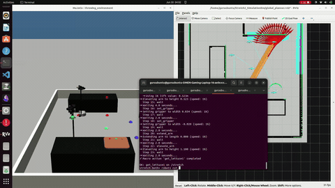
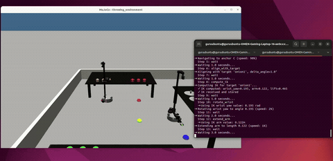
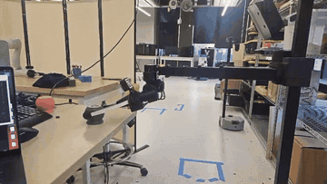
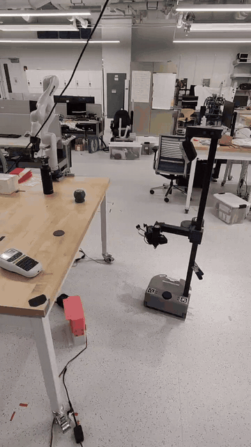

# Stretch 2 Simulation Environment

A high-fidelity MuJoCo-based simulation environment for the **Hello Robot Stretch 2** platform with ROS 2 integration and interactive control.


## Purpose

This simulation environment models a kitchen workspace designed for testing custom Multi-Agent Reinforcement Learning (MARL) models. The environment includes:

- **Kitchen Objects**: Knife, cutting board, plates
- **Pickable Ingredients**: Spherical colored objects representing lettuce (green), onion (white), and tomato (red)
- **Robot Compatibility**: All objects are specifically designed to be pickable by the Stretch 2 robot's gripper
- **Two-Robot Support**: A second Stretch 2 (`stretch2`) can be spawned in the same kitchen to test cooperative/competitive multi-agent behavior

The primary goal of this kitchen model is to test and validate custom Reinforcement Learning algorithms, specifically the [Macro MARL PPO](https://github.com/wwlin1198/macro_marl_ppo) model developed at Northeastern Laboratory (imported locally under `macro_marl_ppo-main/`, with a lightweight training bridge in `mujoco_maciac/`).

## Demos

| Task Manipulation (Sim) | Voice Control (Sim) |
|---|---|
|  |  |

| Real-World Grasping | Real-World Grasping + Navigation |
|---|---|
|  |  |

## Features

- **Physics Simulation** - MuJoCo-based realistic robot dynamics
- **ROS 2 Integration** - Full ROS 2 communication stack, mirrored per-robot (`/stretch/*`, `/stretch2/*`)
- **Interactive Control** - Command-line interface with action-based control, including combined `robot 1` / `robot 2` / `both` commands
- **Autonomous Navigation** - Anchor-based navigation with turn-in-place, plus optional Nav2 (global planner, local planner, or full Nav2 stack) per robot
- **SLAM & Mapping** - Cartographer-based mapping of the simulated world, map saving, and MuJoCo↔map alignment calibration for Nav2
- **MARL Data Collection** - Observation-vector extraction and per-macro-action logging for offline MARL training
- **Voice Control** - Natural-language/voice front-end for dispatching macro actions to either or both robots
- **Real-time Visualization** - Live camera feed and 3D viewer
- **Action System** - YAML-defined micro and macro actions, mirrored for robot 2 (`r2_*` actions)

## Quick Start

### Prerequisites

- Conda (Miniconda or Anaconda)
- ROS 2 Jazzy (optional, for ROS 2 features)
- Python 3.12

### Installation

```bash
# Clone repository
git clone <repository-url>
cd Stretch2_SimulationEnv

# Create environment
conda env create -f environment_ros2.yml
conda activate simenv_ros2
source /opt/ros/jazzy/setup.bash

# Verify setup
python verify_setup.py
```

### Running the Simulation

**Terminal 1: Start Simulation**
```bash
conda activate simenv_ros2
source /opt/ros/jazzy/setup.bash
python stretch_ros2_sim.py
```

**Terminal 2: Interactive Controller**
```bash
conda activate simenv_ros2
source /opt/ros/jazzy/setup.bash
python interactive_controller.py
```

## Interactive Controller

The interactive controller provides an elegant command-line interface:

```bash
stretch> help                    # Show all available actions
stretch> go_to_anchor anchor=A  # Navigate to anchor A
stretch> reset_arm              # Reset arm to default position
stretch> elevate_arm height=0.5 # Move lift to middle position
stretch> turn_towards anchor=ORIGIN  # Turn towards center
```

**Features:**
- Normalized parameters (0-1 range, where 0.5 = middle/default)
- Command history (↑/↓ arrow keys)
- Tab completion
- Action composition via macro actions

### Two-Robot Mode

When `table_world.xml` includes a second robot, run the controller in multi-robot mode to prefix commands with which robot they target:

```bash
python3 interactive_controller.py --namespace both
```

```bash
stretch> robot 1 go_to_anchor anchor=A   # send to /stretch only
stretch> robot 2 get_tomato1             # send to /stretch2 only
stretch> both reset_arm                  # send to both robots
```

## Available Actions

### Navigation
- `go_to_anchor anchor=<A-F|ORIGIN> [speed=0.5]` - Navigate to anchor
- `turn_towards anchor=<A-F|ORIGIN> [speed=0.5]` - Turn towards anchor
- `go_to_position x=<0-1> y=<0-1> [direction=<0-1>] [speed=0.5]` - Navigate to position
- `align_with_target` - Turn towards the veggie (facing veggie so that ik can be implemented once base is fixed)
### Arm Control
- `reset_arm [speed=0.5]` - Reset arm to default position
- `elevate_arm height=<0-1> [speed=0.5]` - Set lift height
- `extend_arm length=<0-1> [speed=0.5]` - Extend/retract arm
- `rotate_wrist angle=<0-1> [speed=0.5]` - Rotate wrist yaw
- `open_gripper [speed=0.5]` - Open gripper fully
- `close_gripper [speed=0.5]` - Close gripper fully
- `set_gripper width=<0-1> [speed=0.5]` - Set gripper width

### Utility
- `wait duration=<seconds>` - Wait for duration
- `wait_for_arm [timeout=<seconds>]` - Wait until arm reaches target
- `compute_ik` - compute inverse kinematics

Every macro/micro action in [actions.yaml](actions.yaml) is mirrored for the second robot with an `r2_` prefix (e.g. `r2_get_tomato1`, `r2_cut_tomato1`, `r2_plate_onion1`).

## Anchors

Predefined navigation points in the world:
- **A, B, C, D, E, F** - Table positions
- **ORIGIN** - Center point (average of all anchors)

## Two-Robot Simulation

`table_world.xml` can host two independent Stretch 2 robots (`stretch31.xml` as robot 1, `stretch31_robot2.xml` as robot 2). `stretch_ros2_sim.py` auto-detects the second robot from the world file and mirrors every topic under a `/stretch2/*` namespace; pass `--single-robot` to force single-robot mode. Useful entry points:

- `stretch2_keyboard_controller.py` - Keyboard teleop for robot 2 (mirrors `stretch_keyboard_controller.py` on `/stretch2/*`)
- `interactive_controller.py --namespace both` - Combined command console (see [Two-Robot Mode](#two-robot-mode) above)
- `voice_macro_controller.py` - Voice/text control of one or both robots (see [Voice Control](#voice-control))
- `test_two_robot_anchor_routes.py`, `test_two_robot_c_b_swap.py`, `test_two_robot_global_anchors.py` - Regression tests for coordinated two-robot navigation (see [Testing](#testing))

## SLAM & Mapping

A Cartographer-based SLAM pipeline builds an occupancy-grid map of the simulated kitchen for use with Nav2:

1. `start_mapping_sim.sh` - Launches the sim with the mapping world (`table_world_mapping.xml` / `stretch31_mapping.xml`)
2. `start_cartographer_mapping.sh` (→ `stretch_cartographer_mapping.launch.py`, config `cartographer_stretch.lua`) - Runs Cartographer SLAM against `/stretch/scan` + `/stretch/odom` to build the map
3. `save_stretch_map.sh` - Saves the finished map (via `nav2_map_server`) into `maps/`
4. `calibrate_map_alignment.py` - Computes the rigid `map → world` transform (translation + yaw) from matched point pairs, used to seed the static `map_to_odom` transform in the Nav2 launch files below

## Nav2 Navigation

In addition to the built-in anchor-based `navigation.py` controller, the sim can drive navigation through ROS 2 Nav2, at three levels of integration (single- or two-robot variants of each):

| Level | Launch file(s) | Sim flag | Start script(s) |
|---|---|---|---|
| Global planner only | `single_robot_global_planner.launch.py`, `two_robot_global_planner.launch.py` | `--global-plan-only` | `start_single_robot_global_planner.sh` / `start_two_robot_global_planner.sh` (+ matching `*_sim.sh`) |
| Global + local planner | `single_robot_local_planner.launch.py`, `two_robot_local_planner.launch.py` | `--local-plan` | `start_single_robot_local_planner*.sh` / `start_two_robot_local_planner*.sh` |
| Full Nav2 stack | `two_robot_nav2.launch.py` | `--nav2` | `start_two_robot_nav2.sh` + `start_two_robot_nav2_sim.sh` |

All levels load the saved map (`maps/careful_map.yaml`) and the static `map→odom` transform from the mapping/calibration step above, and can be visualized with `global_planner.rviz`. Params live in `nav2_*_params*.yaml` (one variant per robot namespace).

## MARL Data Collection

Tooling for building an offline dataset for the [Macro MARL PPO](https://github.com/wwlin1198/macro_marl_ppo) model:

- `stretch_marl_observation.py` - Defines the shared observation vector (base pose, joint angles, per-veggie position/chopped state, task flag) via `build_observation()`
- `print_marl_observation.py` - ROS node that streams the live observation vector for both robots to the terminal
- `record_macro_observations.py` - ROS node that samples the observation after every completed macro action and appends a labeled row to a CSV (default `macro_terminal_observations.csv`)
- `macro_marl_ppo-main/` - Imported copy of the upstream Macro MARL PPO algorithm implementation
- `mujoco_maciac/` - Self-contained MacIAC training bridge intended to consume this sim's observations/actions (not yet fully wired end-to-end)

## Voice Control

`voice_macro_controller.py` provides a natural-language front-end over the macro action system. It parses phrases like *"robot two get tomato one"* or *"both robots get onion three"* (with fuzzy correction for misheard words/numbers) and dispatches them through the interactive controller to `/stretch` and/or `/stretch2`.

```bash
python3 voice_macro_controller.py          # microphone input (speech_recognition + Google recognizer)
python3 voice_macro_controller.py --text   # typed input, no microphone required
```

## Additional Tools

- `nav_cli.py` - Standalone REPL (no ROS required) built directly on `StretchMujocoSimulator` for quick manual driving/debugging (`go <anchor>`, `pos X Y`, `turn <anchor>`, `vel <lin> <ang>`, `stow`, `home`, ...)
- `auto_salad_demo.py` - Scripted demo that runs the full salad-making macro sequence; pass `--stretch2` to run it on robot 2

## Testing

- `test_base_motion_options.py` - MuJoCo-only sweep of base drive strategies (distance traveled, tip-over checks), no ROS required
- `test_two_robot_global_anchors.py` - Sends both robots to anchor goals via the global planner and checks path generation
- `test_two_robot_anchor_routes.py` - Runs 9 predefined paired anchor-swap scenarios using the local planner for both robots
- `test_two_robot_c_b_swap.py` - Focused regression test for two robots swapping anchor positions (robot 1 C→B, robot 2 B→C)

## Project Structure

```
Stretch2_SimulationEnv/
├── stretch31.xml                     # Robot 1 model definition
├── stretch31_robot2.xml              # Robot 2 model definition
├── table_world.xml                   # World with tables, objects, and both robots
├── actions.yaml                      # Action definitions (mirrored per robot with r2_ prefix)
├── stretch_ros2_sim.py                # Main simulation node (single- or two-robot, anchor/Nav2 modes)
├── interactive_controller.py          # Interactive command-line controller (single- or multi-robot)
├── stretch_keyboard_controller.py     # Keyboard controller (robot 1 / /stretch)
├── stretch2_keyboard_controller.py    # Keyboard controller (robot 2 / /stretch2)
├── voice_macro_controller.py          # Voice/text front-end for macro actions
├── nav_cli.py                         # Standalone (non-ROS) navigation REPL
├── navigation.py                      # Anchor-based navigation controller
├── ik.py                              # Damped pseudo-inverse jacobian IK and target-alignment algorithm
│
├── table_world_mapping.xml, stretch31_mapping.xml   # Mapping-mode world/robot
├── cartographer_stretch.lua                          # Cartographer SLAM config
├── stretch_cartographer_mapping.launch.py            # Cartographer launch file
├── calibrate_map_alignment.py                        # MuJoCo↔map alignment calibration
├── maps/                                              # Saved occupancy-grid maps
│
├── single_robot_*.launch.py, two_robot_*.launch.py   # Nav2 global/local planner & full-stack launch files
├── nav2_*_params*.yaml                                # Nav2 planner/controller/bringup params
├── start_*.sh                                         # Convenience launchers for sim/mapping/Nav2 combos
│
├── stretch_marl_observation.py, print_marl_observation.py, record_macro_observations.py  # MARL observation pipeline
├── macro_marl_ppo-main/                               # Imported Macro MARL PPO algorithm implementation
├── mujoco_maciac/                                     # MacIAC training bridge
│
├── test_*.py                                          # Motion and two-robot navigation regression tests
└── assets/                                            # 3D models and textures

```

## ROS 2 Topics

### Subscribed
- `/stretch/cmd_vel` - Base velocity commands
- `/stretch/joint_commands` - Joint position commands
- `/stretch/navigate_to_anchor` - Navigate to anchor
- `/stretch/turn_towards_anchor` - Turn towards anchor
- `/stretch/navigate_to_position` - Navigate to position
- `/stretch/reset_arm` - Reset arm command

### Published
- `/stretch/joint_states` - Current joint states
- `/stretch/navigation_active` - Navigation status
- `/stretch/camera/image_raw` - Camera feed

All topics above are mirrored under `/stretch2/*` when the second robot is enabled. In Nav2 modes, the sim additionally exposes `/stretch/scan`, `/stretch/odom`, `/stretch/tf` (and `/stretch2/*` equivalents), plus the standard Nav2 action interfaces (`ComputePathToPose`, `FollowPath`, `NavigateToPose`) per robot namespace.

## Documentation

- **[SETUP.md](SETUP.md)** - Detailed setup instructions
- **[USAGE.md](USAGE.md)** - Complete usage guide
- **[actions.yaml](actions.yaml)** - Action definitions and examples

## Design Philosophy

- **Normalized Parameters** - All movement parameters use 0-1 range (0=min, 0.5=middle, 1=max)
- **Action Composition** - Macro actions built from micro actions
- **Speed Control** - All movements support speed control (0-1 range)
- **State Synchronization** - Joint states automatically sync with robot

## Resources

- [Stretch 2 Documentation](https://docs.hello-robot.com/)
- [MuJoCo Documentation](https://mujoco.readthedocs.io/)
- [ROS 2 Documentation](https://docs.ros.org/)


